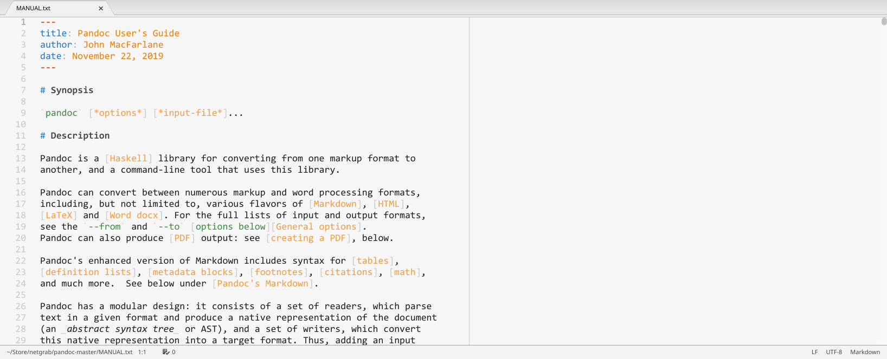

# Pandoc/PDF

Pandoc/PDF is a package for the [Atom editor](https://atom.io/) that makes it possible to use [Pandoc](https://pandoc.org/) directly from an editor pane to create a PDF, and to view that PDF in another Atom pane.

It is __not a preview__ package, because what you see is the final, high-quality PDF output.

Activated by keyboard shortcut (default `Alt-P`) or menu item, Pandoc/PDF inserts a toolbar into the active editor, processes the document with Pandoc, and shows the resulting PDF. By default, the document is reprocessed every time it is saved, but that can be deactivated and reprocessing triggered instead with the keyboard shortcut or a toolbar button.

Pandoc/PDF supports all text-based input formats that can be autodetected by Pandoc (see below), including Pandoc's Markdown, reStructuredText, Textile, MediaWiki & DokuWiki markup, and DocBook. It supports PDF generation via Pandoc's `latex`, `beamer`, `context`, `html`, and `ms` output formats.

## Installation and prerequisites

Install from Atom's Settings/Install dialog (search for `pandoc-pdf`) or via `apm install pandoc-pdf`.

Pandoc needs to be installed and on the path. For full functionality, version 2.9.1 or later is necessary.

At least one PDF engine needs to be installed:

-   Latexmk with pdfLaTeX, XeLaTeX, or LuaLaTeX (e.g. from [TeX Live](https://www.tug.org/texlive/) or [MiKTeX](https://miktex.org/about))
-   ConTeXt with pdfTeX, XeTeX, or LuaTeX (e.g. from [TeX Live](https://www.tug.org/texlive/))
-   [wkhtmltopdf](https://wkhtmltopdf.org/), [WeasyPrint](https://weasyprint.org/), or [Prince](https://www.princexml.com/)
-   pdfroff (from [GNU troff](https://www.gnu.org/software/groff/))

If you choose Latexmk, see the Pandoc documentation for a [list of the LaTeX packages](https://pandoc.org/MANUAL.html#creating-a-pdf) needed by the default template.

To view the generated PDF within Atom, the [pdf-view package](https://atom.io/packages/pdf-view) needs to be installed.

If the input format is Pandoc's Markdown, using the [language-markdown package](https://atom.io/packages/language-markdown) with a supported syntax theme is recommended for editing, but this does not affect the functionality of Pandoc/PDF.

## Toolbar buttons

The toolbar contains the following buttons:

<dl>

<dt> &nbsp; Process with Pandoc into PDF</dt>

<dd>
Triggers reprocessing with Pandoc. Processing occurs in the background, and Pandoc’s log messages are shown in the “Log Messages” dialog.
</dd>

<dt> &nbsp; Toggle Pandoc log messages</dt>

<dd>
Toggles an overlay dialog with shows the Pandoc call including command line arguments, Pandoc’s log messages, and its exit code. The icon is animated during processing, and changes color if warning or error messages are found. If Pandoc aborts processing with an error, the dialog opens automatically.
</dd>

<dt> &nbsp; Save generated PDF</dt>

<dd>
Pandoc generates the PDF file in a temporary directory along with other files, and opens it from there. This button allows to save the PDF to a user-chosen directory.
</dd>

<dt> &nbsp; Open local defaults file in Atom</dt>

<dd>
Recent versions of Pandoc allow options to be specified in a YAML-format <a href="https://pandoc.org/MANUAL.html#default-files">“Defaults File”</a>. Pandoc/PDF checks whether a file with the same name as the document but the extension <code>.yaml</code> is present in the document’s directory, and if yes, passes it to Pandoc. This button makes it easy to create and edit such a local defaults file.
</dd>

<dt> &nbsp; Show intermediate files generated by Pandoc</dt>

<dd>
Opens the temporary directory in the system file browser.
</dd>

<dt> &nbsp; Show Pandoc/PDF settings</dt>

<dd>
Opens the Pandoc/PDF package settings dialog.
</dd>

<dt> &nbsp; Show Pandoc/PDF reference</dt>

<dd>
Shows reference text.
</dd>

</dl>

## Settings

<dl>

<dt>Process on Save</dt>

<dd>
Whether the document should be processed into PDF every time it is saved. 
Disable if processing takes very long or you save the file very often, and use the keyboard shortcut instead.
</dd>

<dt>Pandoc PDF Engine</dt>

<dd>
The program(s) used by Pandoc to create the PDF. 
This setting implies the intermediate output format – and thereby the default template – used by Pandoc: <code>latex</code> for Latexmk, <code>context</code> for ConTeXt, <code>html</code> for wkhtmltopdf, WeasyPrint, and Prince, and <code>ms</code> for pdfroff.
</dd>

<dt>Write beamer</dt>

<dd>
Use the output format <code>beamer</code> instead of <code>latex</code> if the file's pathname matches this JavaScript regular expression. 
Pandoc supports the generation of presentation slides via the LaTeX package beamer through a special output format, but it is not implied by any of the PDF engine settings. As a workaround, this setting allows to select <code>beamer</code> based on the pathname.
</dd>

<dt>Pandoc Template</dt>

<dd>
The name of the <a href="https://pandoc.org/MANUAL.html#templates">template file</a> used by Pandoc to produce the intermediate document that is then processed by the PDF engine. 
If not set, Pandoc's default template for the intermediate output format is used. If set, it should be made specific to the intermediate output format by using the variable <code>${writer}</code>.
</dd>

<dt>Pandoc Defaults</dt>

<dd>
The name of a <a href="https://pandoc.org/MANUAL.html#default-files">defaults file</a> containing additional Pandoc options in YAML format. 
If set, it should be made specific to the intermediate output format by using the variable <code>${writer}</code>. 
Pandoc supports defaults files since version 2.8, and the interplay of a general defaults file specified here and a local defaults file (see above) only works properly since version 2.9.1.
</dd>

</dl>

## Input formats

The text-based input formats which Pandoc recognizes based on the file extension are:

| reader              | format                       | file extension(s)               |
|---------------------|------------------------------|---------------------------------|
| `docbook`           | DocBook                      | `db`                            |
| `dokuwiki`          | DokuWiki markup              | `dokuwiki`                      |
| `fb2`               | FictionBook2 e-book          | `fb2`                           |
| `html`              | HTML                         | `htm`, `html`, `xhtml`          |
| `ipynb`             | Jupyter notebook             | `ipynb`                         |
| `json`              | JSON version of native AST   | `json`                          |
| `latex`             | LaTeX                        | `latex`, `ltx`, `tex`           |
| `markdown`          | Pandoc's Markdown            | `markdown`, `md`, `text`, `txt` |
| `markdown+lhs`      | Literate Haskell             | `lhs`                           |
| `mediawiki`         | MediaWiki markup             | `wiki`                          |
| `man`               | roff man                     | `1` – `9`                       |
| `muse`              | Muse                         | `muse`                          |
| `native`            | native Haskell               | `native`                        |
| `opml`              | OPML                         | `opml`                          |
| `org`               | Emacs Org mode               | `org`                           |
| `rst`               | reStructuredText             | `rst`                           |
| `t2t`               | txt2tags                     | `t2t`                           |
| `textile`           | Textile                      | `textile`                       |

---

This software is copyrighted &copy; 2020 by Carsten Allefeld and released under the terms of the MIT license.
