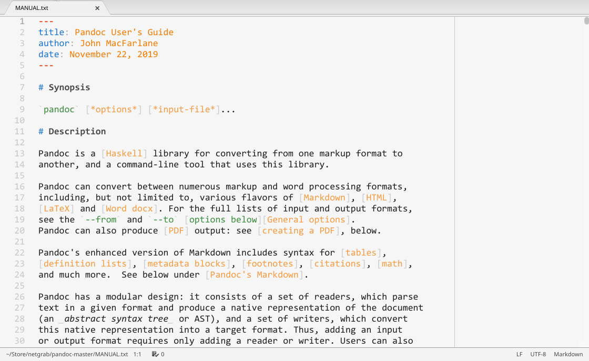

# Pandoc/PDF

Pandoc/PDF is a package for the [Atom editor](https://atom.io/) that makes it possible to use [Pandoc](https://pandoc.org/) directly from an editor pane to create a PDF, and to view that PDF in another Atom pane.

It is __not a preview__ package, because what you see is the final, high-quality PDF output.

Activated by keyboard shortcut (default `Alt-P`) or menu item, Pandoc/PDF inserts a toolbar into the active editor, processes the document with Pandoc, and shows the resulting PDF. By default, the document is reprocessed every time it is saved, but that can be deactivated and reprocessing triggered instead with the keyboard shortcut or a toolbar button.

Pandoc/PDF supports all of Pandoc's text-based input formats, including Pandoc's Markdown, reStructuredText, Textile, MediaWiki & DokuWiki markup, and DocBook. It supports PDF generation via Pandoc's `latex`, `beamer`, `context`, `html`, and `ms` output formats.

## Installation and prerequisites

Install from Atom's Settings/Install dialog (search for `pandoc-pdf`) or via `apm install pandoc-pdf`.

Pandoc needs to be installed. For full functionality, version 2.9.1 or later is necessary.

At least one PDF engine needs to be installed:

-   Latexmk with pdfLaTeX, XeLaTeX, or LuaLaTeX (e.g. from [TeX Live](https://www.tug.org/texlive/) or [MiKTeX](https://miktex.org/about))
-   ConTeXt with pdfTeX, XeTeX, or LuaTeX (e.g. from [TeX Live](https://www.tug.org/texlive/))
-   [wkhtmltopdf](https://wkhtmltopdf.org/), [WeasyPrint](https://weasyprint.org/), or [Prince](https://www.princexml.com/)
-   pdfroff (from [GNU troff](https://www.gnu.org/software/groff/))

If you choose Latexmk, see the Pandoc documentation for a [list of the LaTeX packages](https://pandoc.org/MANUAL.html#creating-a-pdf) needed by the default template.

To view the generated PDF within Atom, the [pdfjs-viewer](https://atom.io/packages/pdfjs-viewer) package is recommended, but [pdf-view-plus](https://atom.io/packages/pdf-view-plus) or [pdf-view](https://atom.io/packages/pdf-view) can be used, too.

If the input format is Pandoc's Markdown, using the [language-markdown](https://atom.io/packages/language-markdown) package with a supported syntax theme is recommended for writing, but this does not affect the functionality of Pandoc/PDF.

## Settings

Pandoc/PDF has settings to choose the PDF engine, Pandoc template and defaults file, and configure input file extensions. For a detailed explanation, see the package settings dialog after installation.

## Toolbar buttons

The toolbar contains the following buttons:

#####    Process with Pandoc into PDF

Triggers reprocessing with Pandoc. Processing occurs in the background, and Pandoc's log messages are shown in the "Log Messages" dialog.

#####    Toggle Pandoc log messages

Toggles an overlay dialog with shows the Pandoc call including command line arguments, Pandoc's log messages, and its exit code. The icon is animated during processing, and changes color if warning or error messages are found. If Pandoc aborts processing with an error, the dialog opens automatically.

#####    Save generated PDF

Pandoc generates the PDF file in a temporary directory along with other files, and opens it from there. This button allows to save the PDF to a user-chosen directory.

#####    Open local defaults file in Atom

Recent versions of Pandoc allow options to be specified in a YAML-format ["Defaults
File"](https://pandoc.org/MANUAL.html#default-files). Pandoc/PDF checks whether a file with the same name as the document but the extension `.yaml` is present in the document's directory, and if
yes, passes it to Pandoc. This button makes it easy to create and edit such a local defaults file.

#####    Show intermediate files generated by Pandoc

Opens the temporary directory in the system file browser.

#####    Show Pandoc/PDF settings

Opens the Pandoc/PDF package settings dialog.

#####    Show Pandoc/PDF reference

Shows reference text.

---

This software is copyrighted &copy; 2020 by Carsten Allefeld and released under the terms of the MIT license.
